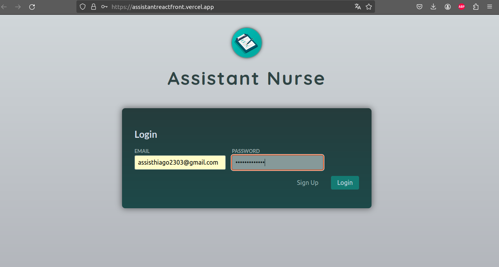
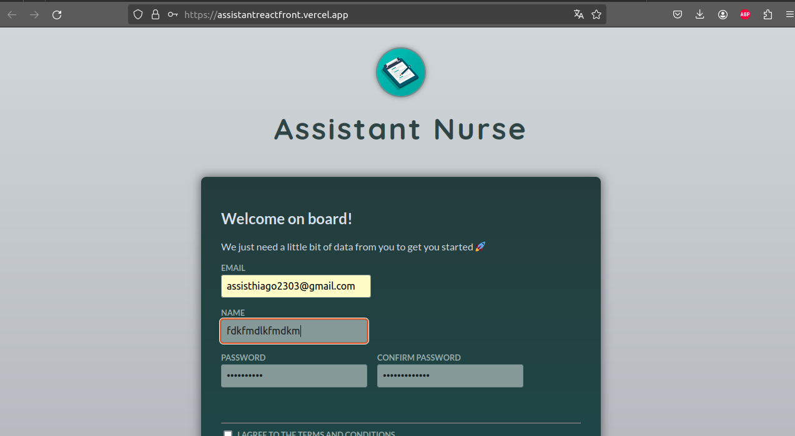

To include images in your Markdown README file, you typically reference them using relative paths. Here's how you can structure your README to include the two screenshots:

````markdown
# Nurse Marketplace Frontend

This is the frontend in React for the nurse marketplace application, connected to the Node.js backend.

## Prerequisites

Make sure you have Node.js installed on your machine.

- Node.js (minimum version 14.x.x)
- npm (minimum version 7.x.x)

## Installation

Clone this repository and install the necessary dependencies.

```bash
git clone https://github.com/thiagoassisk8/nurse-assistant-front
cd nurse-assistant-front
npm install
```
````

## Backend Configuration

Before starting the frontend, make sure the backend is properly configured and running at the correct URL.

## Running the Application

To start the React application, use the following command:

```bash
npm run dev
```

The application will run in development mode.<br />
Open [http://localhost:3000](http://localhost:3000) in your browser to view it.

## Features




## Technologies Used

- React
- React Router DOM for managing routes

## More Information

For more details about the project, check out the corresponding [backend repository](https://github.com/thiagoassisk8/nurse-assistant).

---

This project was developed as part of a nurse marketplace application, focusing on registration and login functionalities using JWT for authentication.
